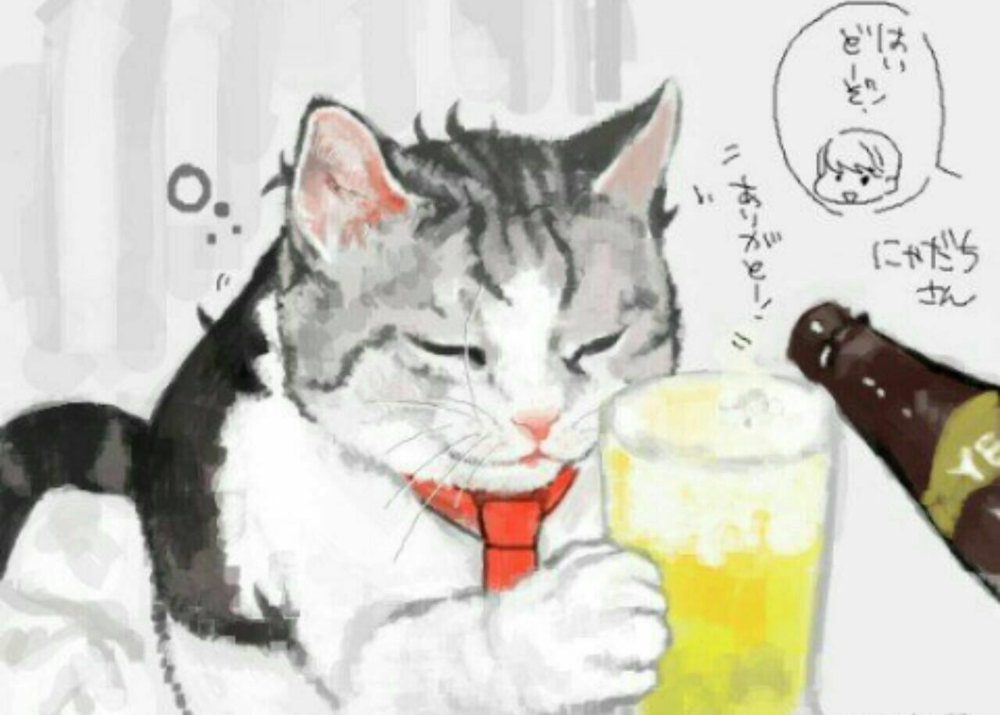

# Disclaimer
### This is **not battle-tested** software version and may contain bugs or any different bad moments.
### Feel free to contribute and create PR's.

# General information
Current implementation consists of two basic encoding methods:
- `XOR`
- `base64`

Anyone of them is enough to hide strings from static analyzers, but despite this, new encoding methods and tricks will be added soon (or not ;D). In general this library was created for internal(corporate) usage and for extend `Rust` knowledge. Examples can be found in `examples` folder(not obvious ofc). Maybe you can use it in game ~~hacking~~ modding ;), or to hide some secret information from your cat.

[Our discord](https://discord.gg/9p9zw3V)